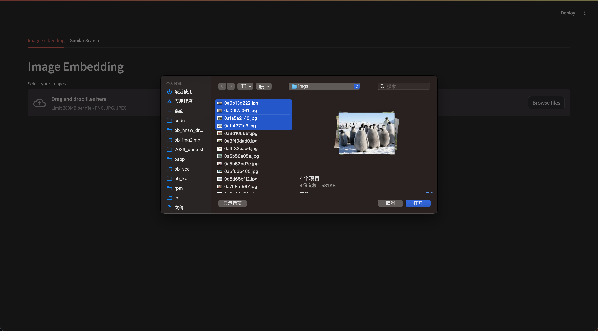
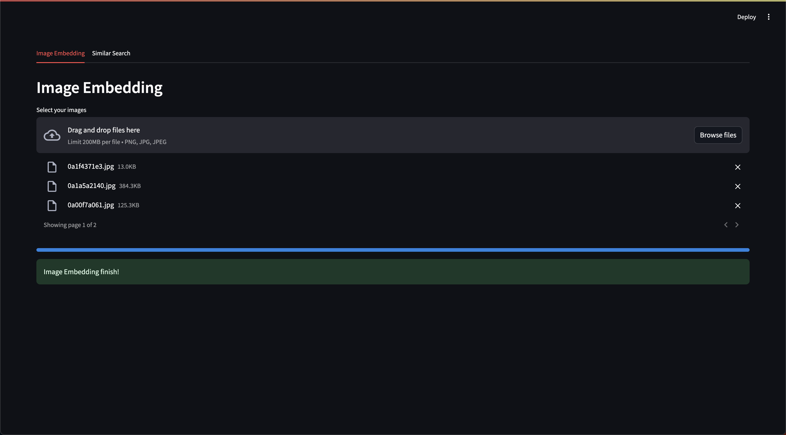
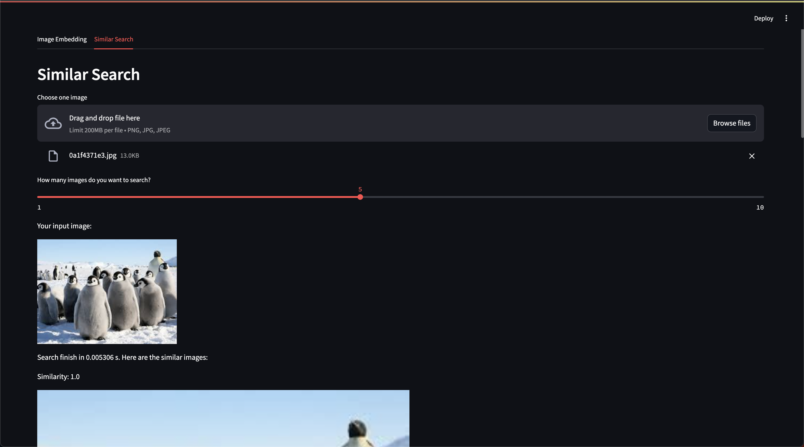

# An img2img demo for OceanBase Vector Store

This is a demo of similar image search based on OceanBase Vector Store.

- [OceanBase Vector Store](https://github.com/oceanbase/oceanbase/tree/vector_search)
- [text2img embedding model: CLIP](https://huggingface.co/openai/clip-vit-large-patch14)

## How to deploy demo with docker?

1. Build docker image.

```shell
docker build -t ob_img2img .
```

2. Run docker image with docker-compose.

```shell
docker-compose up
```

3. After `boot success!`, visit `localhost:8501`

- Select the image you want to import. (Here are some sample images in the `img` directory)



- Waiting for image embedding & vector insertion into OceanBase.



- Do similar image search.

